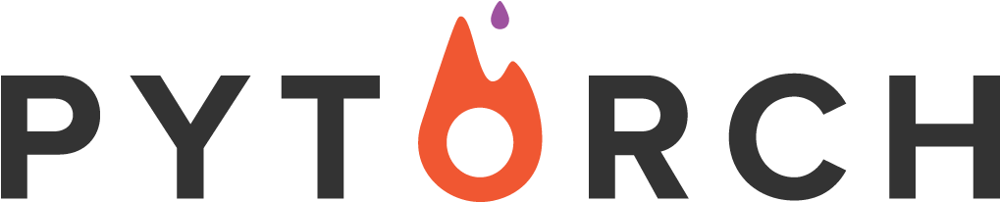

# PyTorch-ZerotoGANs
<p align="center"></p>

--------------------------------------------------------------------------------

This repository provides tutorial code for deep learning researchers to learn [PyTorch](https://github.com/pytorch/pytorch). 


<br/>

## Table of Contents

#### 1. Basics
* [PyTorch Basics](PyTorch%20Basics/Pytorch_basics.py)
* [Linear Regression]()
* [Logistic Regression]()
* [Feedforward Neural Network]()

#### 2. Intermediate
* [Convolutional Neural Network]()
* [Deep Residual Network]()
* [Recurrent Neural Network]()
* [Bidirectional Recurrent Neural Network]()
* [Language Model (RNN-LM)]()

#### 3. Advanced
* [Generative Adversarial Networks]()
* [Variational Auto-Encoder]()
* [Neural Style Transfer]()
* [Image Captioning (CNN-RNN)]()

#### 4. Utilities
* [Google Colab](https://colab.research.google.com/)

#### 5. Refrences
* [Deep Learning with PyTorch: Zero to GANs](https://jovian.ai/learn/deep-learning-with-pytorch-zero-to-gans)

<br/>

## Getting Started
```bash
$ git clone https://github.com/yunjey/pytorch-tutorial.git
$ cd pytorch-tutorial/tutorials/PATH_TO_PROJECT
$ python main.py
```

<br/>

## Dependencies
* [Python 2.7 or 3.5+](https://www.continuum.io/downloads)
* [PyTorch 0.4.0+](http://pytorch.org/)
